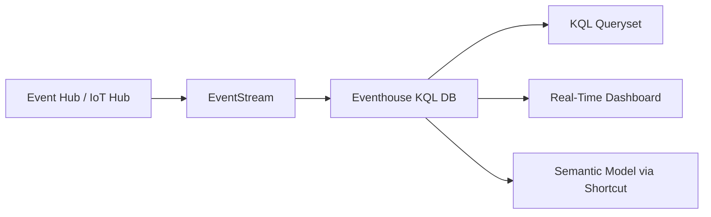

# Eventhouse — Real-Time Intelligence
Microsoft Fabric's real-time analytics engine powered by Azure Data Explorer (Kusto). Ingests streaming data from EventStream and enables KQL-based analysis on hot data with sub-second latency.
## Architecture


## Create Table with Ingestion Policy
```kql
.create table SensorData (
    timestamp: datetime,
    device_id: string,
    temperature: real,
    vibration: real
)

.alter table SensorData policy ingestiontime true

.create table SensorData ingestion json mapping "JsonMapping"
'[{"column":"timestamp","path":"$.ts"},
  {"column":"device_id","path":"$.id"}]'
```